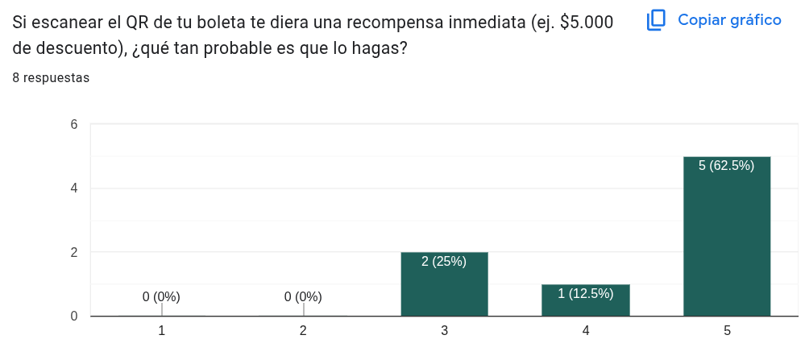
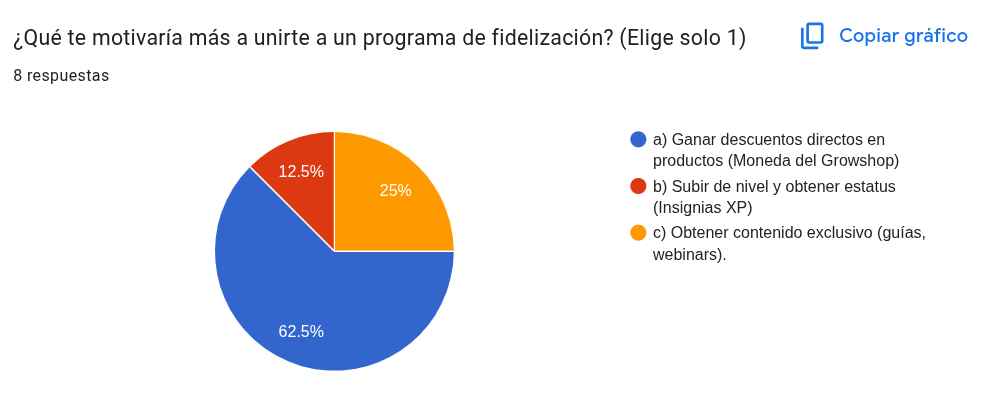
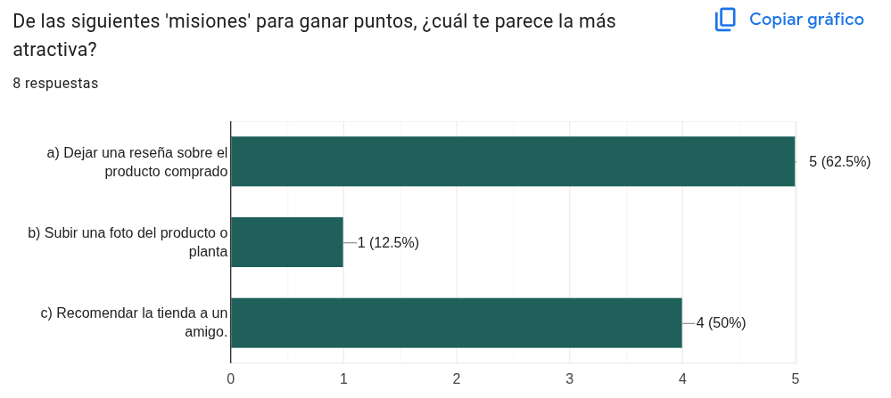
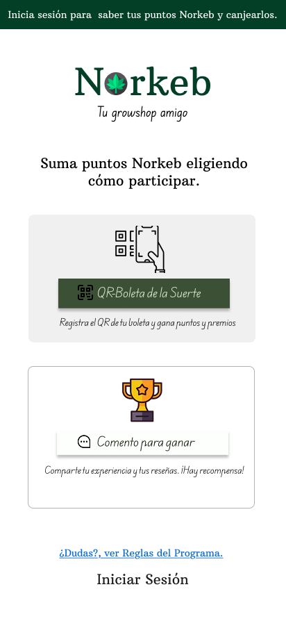
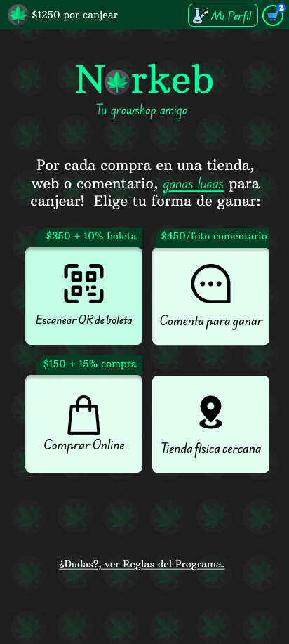
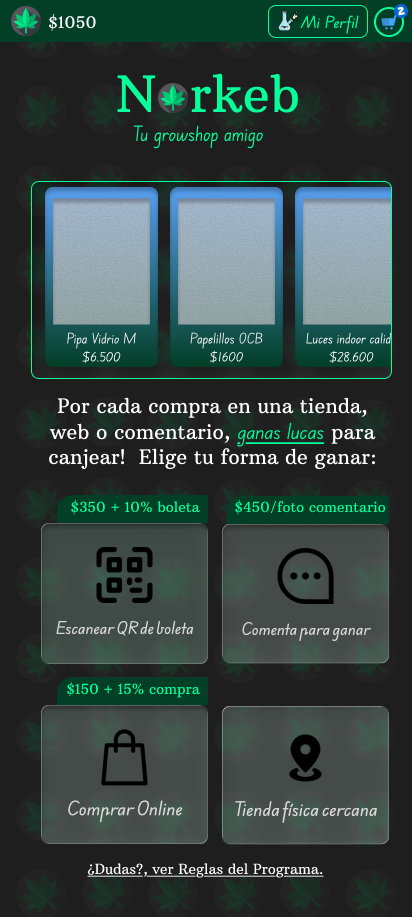
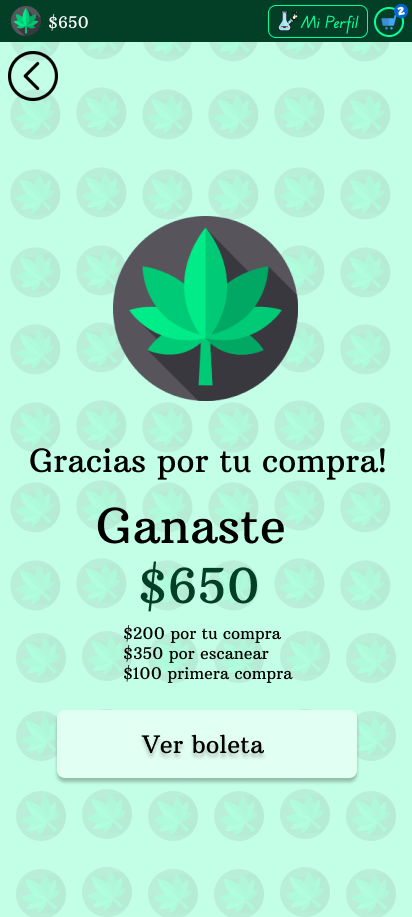

# NORKEB: Una app para mejorar la fidelización de clientes mediante estrategias de gamificación por compras

#### Autor: Fabián Catalán
#### Tags: UX Research, Surveys, Agile, Prototype, Wireframes

> Ult. Actualización: 20 de Noviembre de 2025 

El desarrollo de una aplicación siguiendo procesos de diseño requiere, tanto en teoría como en práctica, una validación constante con usuarios, clientes y partes interesadas. Este enfoque permite respaldar cada decisión y asegurar que los avances del proyecto estén alineados con las necesidades reales del mercado.

 Se realizó bajo el marco del UX Research, la recopilación de información valiosa a potenciales clientes pertenecientes a un nicho de mercado de artículos desechables -parafernalias- de consumo fumador y de cultivo indoor, testeando bajo encuestas, la idea de **ofrecer descuentos y beneficios por cada compra usando tecnología QR de por medio**. Dado los resultados, se hizo validación de la idea y se construye por iteraciones las estructuras de las pantallas importantes de la aplicación, cuyas percepciones de diseño se recogieron mediante mensajes directos y dichas retroalimentaciones fueron contrastadas con los modelos de diseño probados en la industria. Actualmente se encuentra finalizando de la fase de investigación y validación de diseño.

## La idea

Desde inicios de Noviembre, nace un proyecto piloto colaborativo y comunitario enfocado en la creación de una aplicación web que apoya a una tienda Growshop bajo UX Research, aplicando investigación previa, apoyo social y una hipótesis de diseño nació: **"Norkeb, tu growshop amigo"**. 

Usando QR como forma digital de simplificación de procesos y mejora de usabilidad, decidí estudiar si es atractivo aumentar la fidelización de clientes y la mejora de experiencia de marca usando códigos QR que refleje las compras y bonificaciones gamificadas del uso de la aplicación de la marca Norkeb.

## Validación de la idea y resultados de primera encuesta

De la primera encuesta  se plantearon 10 preguntas de estudio que puedes [ver aquí](./assets/forms/Norkeb_formulario.pdf) cuyo fin es medir variables de decisión de los participantes bajo la hipótesis de comprar en un growshop y los posibles beneficios que se podrían ofrecer, recolectando sus preferencias y estilos de cliente.

Dividido en 3 áreas, la encuesta midió:
- la experiencia de compra & la comunidad
- interés en comunidad & anonimato
- motivación y recompensas.

### Resultados de la encuesta

> Según [los artículos de Jakob Nielsen](https://www.nngroup.com/articles/why-you-only-need-to-test-with-5-users/), manifiesta que con solo 5 encuestados son más que suficientes para tomar desiciones rápidas de diseño. Aunque hay discusiones de la [vigencia de lo anterior](https://medium.com/@anna.y.dickinson/its-not-five-users-c11da404f299) tenemos una muestra interesante con resultados coherentes para esta primera iteración.

El rango de edades de los ocho encuestados está entre los 25 y 44 años, con tendencias a cultivo (62.5%) y consumo.
Declaran guardar siempre o temporalmente las boletas físicas (75%). La novena pregunta agrega un dato interesante: los usuarios manifiestan un interes medio-alto de ganar recompensas bajo esta mecánica de escaneo de QR de boletas (ver imagen #1), obteniendo dos indicadores que respaldan, en primera iteración, que nuestra técnica de fidelización de escaneo de QR de boletas *podría ser viable*.

Imagen #1 Probabilidad de escanear el QR una boleta de Norkeb.

Por otro lado, todos manifiestan tener un interes medio-alto en información sobre el uso y cultivo de estos productos. Siguiendo la línea de la comunidad, se testea si están dispuestos a  compartir fotos y consejos de plantas y productos, manifestando interes medio-alto (87.5%) manteniedo una preocupación media-alta de anonimato. Se considera preguntar directamente qué les motiva más a unirse a un programa de fidelización, escogiendo en su gran mayoría el "ganar descuentos directos en productos (62.5%), obtener contenido exclusivo (25%), y leve interés (12.5%) por gamificar via reconocimiento por niveles y estatus / insignias.

Imagen #2 Motivación por programa de fidelización

En la última pregunta de gamificación evaluamos el interés de tres posibles misiones

- Dejar una reseña sobre el producto comprado (5 votos, 62.5%)
- Subir una foto de producto o planta (1 voto)
- Recomendar tienda a un amigo (4 votos, 50%)

Imagen #3 Misiones y testeo de gamificación.

# Investigación y Definición de Usuarios

El objetivo de esta investigación fue perfilar al usuario principal de Norkeb mediante una encuesta realizada a 8 personas entre el 1 a 4 de noviembre, para validar la tracción de una propuesta de Programa de Fidelización Digital que combina una comunidad web con un sistema de recompensas.

### Resumen del Diseño
- La solución debe ser digital, móvil e incorporar elementos sociales, se infiere que los usuarios pesquizados son adultos jóvenes digitalmente activos.
- La motivación principal es canjear y materializar los puntos - moneda en valor tangible, es decir, la app debe estimular lo transaccional via descuentos directos
- La web es un valor añadido a la tienda, y la sección de comunidad como sección de gamificación debe priorizar la privacidad y anonimato total.
- Escanear la boleta se entiende que es una recompensa y a la vez una misión gamificada debido al beneficio que se obtendrá de esa acción.

## Perfil del Usuario digital Norkeb

### El Cultivador:

- Adulto joven, comprador de temporada (62.5% compra espaciadamente al menos 3 veces al año) relacionado a semillas, equipos como también fertilizantes.  Mencionar que estas preguntas eran de opción única, lo que estamos infiriendo fuera de encuesta que **el que cultiva también consume**, pero por ahora, esta conclusión queda incluida implícitamente dentro de este diseño sin validación explícita.

### El consumidor casual

- Adulto joven, (37.5% de los encuestados) compra al menos dos veces al mes productos ligeramente inclinados a parafernalia. Dado que el porcentaje de consumidores es menor a los cultivadores, vamos a inferir, por sentido común, que **el consumidor casual no cultiva**.

## Mecanismo gamificado de misiones y monedas

Por simplicidad, los puntos Norkeb vs moneda chilena son 1 a 1, es decir, los puntos es dinero real canjeable. La misión más atractiva para ganar puntos son:

- Dejar una reseña sobre el producto comprado (muy valioso para Norkeb)
- Recomendar la tienda a un amigo (muy relevante la opción de referidos).

## Conclusión Estratégica
La estrategia de fidelización es atractiva y viable siempre que se enfoque en el valor transaccional para el usuario.

Se desprenden tres lineas de diseño:

- Diseñar la arquitectura de recompensas
- Diseñar el flujo de adopción (escaneo de QR y compras online)
- Diseñar la comunidad anónima mediante reseñas.

# Arquitectura de Recompensas

El objetivo es incentivar la adopción, la repetición de compra y generación de contenido.

Desde ahora, los puntos Norkeb pueden ser llamados como 'monedas' o simplemente 'puntos'. Dada la paridad 1:1, el sistema es fácil de entender y trasparente para el usuario

### Definición y tasas de ganancias:

Con cada misión ganas puntos base más un porcentaje de lo comprado.

$$Puntos_{Mision} = Base_{misión} + tasa_{misión} * TotalBoleta$$

| Misión|Base   | Tasa  |
|---    |---    |---    |
|Unirse | $100  | 0%    |
|QR Scan| $350  | 10%   |
|Reseña | $450  | 0%    |
|Compra online| $150 | 15% |

Entonces, si un usuario compra $20.000 en tienda física y escanea el QR de la boleta, tenemos ganancia por unirse y por haber escaneado.

$$Puntos += Puntos_{unirse} + Puntos_{Scan QR}$$
$$Puntos += 100 + (350 + 20000*0.1)$$
$$Puntos = \$650$$

Estos puntos pueden ser canjeados en una siguiente boleta.
Para efectos económicos, no sale rentable crear estos mecanismos de ganancias, da igual, lo que importa por ahora es el entendimiento del proceso de diseño.

### Limitaciones

Se debe informar que los canjeos o descuentos solo son accionables si los puntos son mayor o igual a una cifra. Definamos ese valor en 2.500.

Estas definiciones deben ser contenidas bajo estructuras de patrones de diseños adecuadas y equilibradas porque es lógico que pueden sufrir cambios.

# Test de Usabilidad bajo escenario
## Validación de Prototipo preliminar usando Figma

La meta de este prototipo es ver si el usuario entiende cómo escanear, porqué escanear y como eso le beneficia. Para ello, a cinco encuestados se les hizo revisar la siguiente imágen, pidiéndoles no enfocarse en detalles visuales. Mencionaron que no les resultaba cómodo ni convincente, los colores e íconos distraían mucho. Después de esas quejas, obtuve que:

- Los botones no son llamativos (poco Call to action)
- Prototipo muy genérico y opaco
- Cambiar la estructura de los botones y sus textos
- No queda claro cómo funciona los descuentos
- Que tenga contrastes mas profundos

## Iteración dos:

Se toman algunas sugerencias del prototipo uno. Agregamos texturas de fondo y generalicé íconos y botones. Dejé claro el beneficio de cada misión, obteniendo mayor aprobación del diseño, aunque personalmente no me convence del todo.

## Iteración tres de usabilidad
### El recorrido

EL usuario debe aprender a usar la app, en específico, debe aprender la noción de escanear las boletas para su beneficio. Como primera misión, a mis encuestados le contaré un pequeño storytelling introductorio.

> "Mira, necesitamos comprar un bong y papelillos. Solo tenemos 20000 en efectivo asi que no podemos comprar online, tu misión es comprar solamente eso y ver que tanta maravilla es eso de que escaneando la boleta ganas plata para canjear en la tienda."

# Prototipo interactivo

[interactuar por acá](https://www.figma.com/proto/GfNHqGwrQjXyZAIueRdXeM/MVP2025?node-id=11-124&t=GgtRzciGXq16is9j-1)